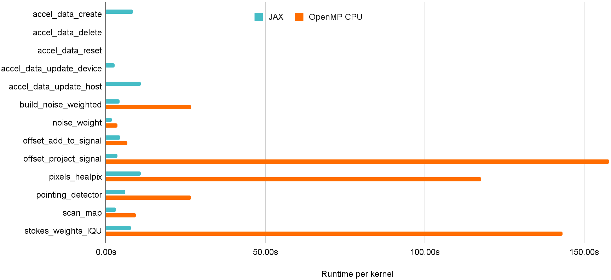
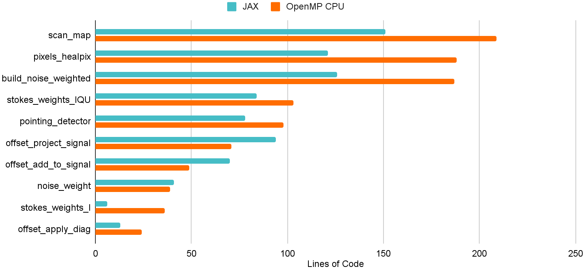

<!-- _class: title -->
# **Introduction to porting Python to GPU with JAX**
## Laboratoire Astroparticule & Cosmologie 2024

<div class="authors">
<strong>Nestor Demeure</strong><br>
National Energy Research Scientific Computing Center, Berkeley CA, United-States
</div>

---
# Who am I?

I am a member of NERSC's **Programming Environments and Models** group with a focus on high performance computing, numerical accuracy and artificial intelligence.

I specialize in helping teams of researchers make use of high performance computing environments.

I am just off a postdoc helping port the *[TOAST software framework](https://github.com/hpc4cmb/toast)* to the new Perlmutter supercomputer and, in particular, to graphic processors (GPU).

---
<!-- _class: section-title -->
# Introduction
## Goals and scope of this workshop

---
# Goals

By the end of this workshop I want you to:

* Have a basic mental model of JAX,
* be able to port your code to JAX,
* be able to run it on a GPU,
* know if JAX is a good fit for your application,
- ***not*** be able to implement a neural network in JAX.

---
# Summary of the workshop

* Introduction,
* Porting a Python code to GPU,
* Introducing JAX,
+ Using JAX,
* Case study,
* Overview and perspectives.

---
# Up to x45 speed-up from optimized C++ to JAX!



---
<!-- _class: section-title -->
# Porting a Python code to GPU
## Pros and cons of the current approaches

---
# Using off-the-shelf kernels

Call a library providing off-the-shelf kernels:
* *[Numpy](https://numpy.org/) → [Cupy](https://docs.cupy.dev/en/stable/reference/routines.html)*
* *[Scipy](https://scipy.org/) → [Cupy](https://docs.cupy.dev/en/stable/reference/scipy.html)*
* *[Pandas](https://pandas.pydata.org/) → [RAPIDS CuDF](https://docs.rapids.ai/api/cudf/stable/)*
* *[Scikit-learn](https://scikit-learn.org/stable/) → [RAPIDS CuML](https://docs.rapids.ai/api/cuml/stable/)*


+ Very easy to use,
+ perfect if you find what you need,
- cannot write your own kernel,
- performance loss:
  * allocating intermediate values,
  * more data transfers to the GPU.

---
# Using a deep-learning library

Use a deep-learning library:
* *[Pytorch](https://pytorch.org/)*
* *[Tensorflow](https://www.tensorflow.org/)*
* *[JAX](https://jax.readthedocs.io/en/latest/)*

+ Great for deep-learning,
+ easy to use and well documented,
+ support for most numerical building blocks,
- *usually*, a large overhead:
  * gradient computation,
  * intermediate values.

---
# Writing a kernel in a low-level language

Write a kernel in **CUDA** / **OpenCL** / **HIP** / **SYCL** / etc and link it in Python.  
You can use *[PyOpenCL](https://documen.tician.de/pyopencl/)* or *[PyCuda](https://documen.tician.de/pycuda/)* to link your kernel.

+ Perfect control of performance,
- cannot reuse numerical building blocks (PRNG, FFT, linear algebra),
- requires a lot of expertise:
  * to write code that is *actually* **performant**,
  * to write **correct** code,
  * to **compile and link** the result into Python.

---
# Writing a kernel in Python

Write a kernel in Python using:
* *[Numba](https://numba.readthedocs.io/en/stable/cuda/index.html)*,
  * limited Numpy support,
  * low-level CUDA-like syntax,
* *[Taichi](https://www.taichi-lang.org/)*
  * focus on graphics,
  * requires implementing most of the operations you need from scratch,
* *[Triton](https://github.com/openai/triton)*
  * no library support,
  * low-level unique syntax.

+ Full Python codebase,
- can still be very low-level,
- very limited building blocks.

---
<!-- _class: question -->
# **Can we have good GPU performance, portability, and productivity?**
## (in Python)

---
<!-- _class: section-title -->
# Introducing JAX
## High-level introduction to JAX

---
# What is JAX?

*[JAX](https://github.com/google/jax)* is a Python library to write code that can run in parallel on:

* CPU,
* GPU (*[NVIDIA, AMD, and Apple](https://github.com/google/jax#supported-platforms)*),
* TPU,
* etc.

Developed by Google as a building block for deep-learning frameworks. Seeing wider use in numerical applications including:

* [Molecular dynamics](https://github.com/google/jax-md),
* [computational fluid dynamics](https://arxiv.org/abs/2203.13760),
* [ocean simulation](https://veros.readthedocs.io/en/latest/),
* [cosmology](https://github.com/eelregit/pmwd).

---
# What does JAX look like?

It has a Numpy-like interface:

```python
from jax import random
from jax import numpy as jnp

key = random.PRNGKey(0)
x = random.normal(key, shape=(3000, 3000), dtype=jnp.float32)
y = jnp.dot(x, x.T)  # runs on GPU if available
```

---
# How does JAX work?

Calls a ***just-in-time compiler*** when you execute your function with a ***new problem size***:

<iframe style="width:100%; border:none;" src="images/jax_xla_schematics.html"></iframe>

---
# JAX's limitations

- Compilation happens just-in-time, at runtime,
  * easily amortized on a long running computation
- input sizes must be known to the tracer, 
  * padding, masking and recompiling for various sizes
- loops and tests are limited inside JIT sections, 
  * JAX provides replacement functions
- no side effects and no in-place modifications, 
  * one gets used to it, it actually helps with correctness
- focus on GPU optimizations rather than CPU.
  * there is growing attention to the problem

---
# JAX's strengths

+ Focus on the semantic, leaves optimization to the compiler,
+ single code base to deal with CPU and GPUs,
+ immutable design is actually *nice* for correctness,
+ easy to use numerical building blocks inside kernels.

---
<!-- _class: question -->
# **How do we use it?**

---
<!-- _class: section-title -->
# Using JAX
## Writing JAX code

---
# Numpy-like syntax

If you know Numpy you are 90% of the way there:

```python
import jax.numpy as jnp

x = jnp.ones(shape=(1000,1000))
y = 2 * jnp.zeros(1000)

z = jnp.dot(x, jnp.cos(y))
y2 = jnp.linalg.solve(x, z)
```

---
# Mutability

JAX arrays are **immutable** but, you can use shadowing and *[.at[] functions](https://jax.readthedocs.io/en/latest/_autosummary/jax.numpy.ndarray.at.html#jax.numpy.ndarray.at)*:

```python
# arr += 1
arr = arr + 1

# arr[index] = 1
# WARNING: this produces a new array
arr = arr.at[index].set(1)

# arr[index] += 1
# NOTE: this operation is atomic
arr = arr.at[index].add(1)
```

---
# Just-in-time compilation

JAX will be *slow* unless you *[compile](https://jax.readthedocs.io/en/latest/jax.html#just-in-time-compilation-jit)* your code:

```python
from jax import jit

def f(x):
   print("Tracing right now!")
   return x*2

f_jitted = jit(f)
y = f_jitted(x)
```

* Recompile when the **static inputs** (including problem size) are changed,
* inputs can be built-in types, arrays, lists, dictionaries, struct, etc.

---
# Just-in-time compilation: static values

Numbers, booleans and user defined struct can be marked as **static**:

```python
from jax import jit

def f(x, should_double):
   return (x*2) if should_double else x

# specify static inputs
f_jitted = jit(f, static_argnames=["should_double"])
```

* Useful to **help optimizer** and **workaround limitations** in tests and loops,
* value needs to be **hashable** (does not apply to lists and arrays),
* will **trigger recompilation** if the value is changed.

---

# Just-in-time compilation: donate input

Inputs can be **donated**:

```python
from jax import jit

def f(x):
   return 2*x

# specify donated inputs
f_jitted = jit(f, donate_argnums=[0])
```

* useful to **reduce allocations**,
* does **not currently apply to CPU**.

---

# Conditionals

*In jitted sections*, you can only perform tests on static values, instead:

* Use *[where](https://jax.readthedocs.io/en/latest/_autosummary/jax.numpy.where.html?highlight=where)* to combine inexpensive computations with a mask,
* use *[cond](https://jax.readthedocs.io/en/latest/_autosummary/jax.lax.cond.html?highlight=cond)* to run expensive computations depending on a boolean.

```python
import jax

# where
y = jax.numpy.where(is_true, y_true, y_false)

# cond
y = jax.lax.cond(is_true, f_true, f_false, x)
```

---

# Loops and vectorisation

*In jitted sections*, loop conditions are restricted to static values and will be **unrolled**:

* JAX provides *[control flow operators](https://jax.readthedocs.io/en/latest/jax.lax.html#control-flow-operators)* including *[while_loop](https://jax.readthedocs.io/en/latest/_autosummary/jax.lax.while_loop.html#jax.lax.while_loop)* and *[fori_loop](https://jax.readthedocs.io/en/latest/_autosummary/jax.lax.fori_loop.html#jax.lax.fori_loop)*,
* JAX let you *[vectorise](https://jax.readthedocs.io/en/latest/jax.html#vectorization-vmap)* your function with *[vmap](https://jax.readthedocs.io/en/latest/_autosummary/jax.vmap.html#jax.vmap)*, *[pmap](https://jax.readthedocs.io/en/latest/_autosummary/jax.pmap.html#jax.pmap)* and *[xmap](https://jax.readthedocs.io/en/latest/_autosummary/jax.experimental.maps.xmap.html?highlight=xmap)*.

```python
from jax.experimental.maps import xmap
from jax import vmap

#for i in range(nb_i):
#   for j in range(nb_j):
#      result[i,j] = f_body(x[i,j,:], y)

f_vmap_j = vmap(f_body, in_axes=(0,None), out_axes=0)
f_vmap_ij = vmap(f_vmap_j, in_axes=(0,None), out_axes=0)

f_xmap_ij = xmap(f_body, in_axes=[['i','j',...], [...]], out_axes=['i','j'])
```

---

# Pseudo random number generation

JAX uses *[its own PRNG](https://jax.readthedocs.io/en/latest/jax.random.html)* tailored for parallelism and reproducibility:

```python
from jax import random

# initialize PRNG
seed = 1701
key = random.PRNGKey(seed)

# generates random numbers
key, subkey = random.split(key)
x = random.normal(subkey, shape=(3000, 3000))
```

---

# Automatic differentiation

JAX does *[automatic differentiation](https://jax.readthedocs.io/en/latest/jax.html#automatic-differentiation)* by code transformation:

```python
from jax import grad

# computes the derivative of the function f
df = grad(f)

# gets a result and its derivative
y = f(x)
dx = df(x)
```

* Can be applied repeatedly for **higher order derivation**,
* overhead **similar to analytic solution**,
* **no overhead** to function that are not differentiated,
* *[some operations](https://jax.readthedocs.io/en/latest/notebooks/Common_Gotchas_in_JAX.html#summary)* cannot be differentiated.

---

# Performance tricks

You can do three easy things to improve performance significantly:

* Minimise the number of **recompilations**,
* put a maximum of your **code inside a jitted section**,
* **keep the data on GPU**, inside JAX arrays.

**Warning:** JAX will **unroll** loops causing long compile times,
use *[fori_loop](https://jax.readthedocs.io/en/latest/_autosummary/jax.lax.fori_loop.html)*, *[while_loop](https://jax.readthedocs.io/en/latest/_autosummary/jax.lax.while_loop.html)*, or *[scan](https://jax.readthedocs.io/en/latest/_autosummary/jax.lax.scan.html)* when possible.

---

# Useful libraries

The *[Awesome JAX](https://github.com/n2cholas/awesome-jax)* repository has a *lot* of good references. I would recommend:
* *[MPI4JAX](https://github.com/mpi4jax/mpi4jax)*: MPI support for JAX,
* *[JAXTyping](https://github.com/patrick-kidger/jaxtyping)*: type and shape checking,
* *[Einshape](https://github.com/deepmind/einshape)*: alternative reshaping syntax,
* *[Xmap](https://github.com/nestordemeure/xmap/tree/main)*: a better xmap implementation,
* optimizers and solvers built in JAX:
  * *[Optax](https://github.com/google-deepmind/optax)*: common optimizers and loss functions,
  * *[Lineax](https://github.com/patrick-kidger/lineax)*: linear solvers,
  * *[Optimistix](https://github.com/patrick-kidger/optimistix)*: non-linear solvers.
* deep learning frameworks built upon JAX:
  * *[Equinox](https://github.com/patrick-kidger/equinox)*: focus on simplicity,
  * *[FLAX](https://github.com/google/flax)*: Google's standard framework,
  * *[etc](https://github.com/n2cholas/awesome-jax#libraries)*.

---

# Exercises!


---

<!-- _class: question -->
# **Is it worth it?**

---

<!-- _class: section-title -->
# Case study
## Porting the TOAST codebase to GPU

---

# TOAST

*[TOAST](https://github.com/hpc4cmb/toast)* is a large Python application used to study the **cosmic microwave background**.

It is made of pipelines distributed with MPI and composed of **C++ kernels parallelized with OpenMP**.

Kernels use a **wide variety of numerical methods** including random number generation, linear algebra, and fast fourier transforms.

We ported **13 kernels to GPU**.

---

# Porting the code

Kernels were ported **from C++ to Numpy to JAX** and validated using **unit tests**.

**Kernels loop on irregular intervals**, we introduced a **imap** vectorizing function to automate padding and masking.

**Kernels mutate output parameters**, we introduced a **MutableJaxArray** type to box JAX arrays.

**Data movement is expensive**, we move data *once* at the beginning and end of each pipeline call.

---

# Porting the code (x7 reduction in lines of code)



---

# Performance per kernel (up to x45 speed-up)


---

# Perspectives

This was a *proof of concept*, we can improve and simplify things significantly:

* **Reduce data movement**,
* remove C++ dependencies by **porting more kernels**,
* default to **JAX arrays** and **pure functions**,
* redesign pipelines to JIT them into **single GPU kernels**.

---

<!-- _class: section-title -->
# Conclusion
## Should you use JAX in your project?

---

# JAX's Limitations

- Compilation happens just-in-time, at runtime,
  * easily amortized on a long running computation
- input sizes must be known to the tracer, 
  * padding, masking and recompiling for various sizes
- loops and tests are limited inside JIT sections, 
  * JAX provides replacement functions
- no side effects and no in-place modifications, 
  * one gets used to it, it actually helps with correctness
- focus on GPU optimizations rather than CPU.
  * there is growing attention to the problem

---

# JAX's Strengths

I believe JAX is in a **sweet spot for research and complex numerical codes**:

+ Focus on the **semantic**, leaves optimization to the compiler,
+ **single code base** to deal with CPU and GPUs,
+ immutable design is actually *nice* for **correctness**,
+ easy to use **numerical building blocks** inside kernels.

---

# Should you use JAX?

* Your code is written in **Python**,
* your code can be written with **Numpy**,
* your array sizes are **not too dynamic**,
* single-thread CPU is an **acceptable fallback** in the absence of GPU.

---

<!-- _class: thanks -->
# **Thank you!**
## ndemeure@lbl.gov