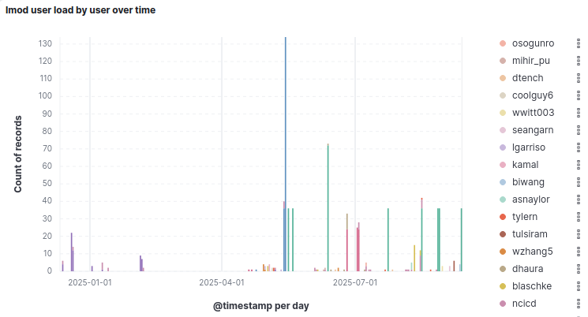

<!-- _class: title -->

# **Rust at NERSC**
## Usage and Facilities
### Internal Discussions

<strong>Nestor Demeure</strong> 
National Energy Research Scientific Computing Center, Berkeley CA, United States

---

# Who am I?

I am a member of NERSC's **Programming Environments and Models** group, with a focus on high performance computing, numerical accuracy, and artificial intelligence.

I specialize in helping teams of researchers make use of high performance computing environments.

In particular, I am **in charge of the Rust programming language at NERSC**.

---

<!-- _class: question -->

# **Why care about Rust in high-performance computing?**

---

<!-- _class: section-title -->

# The Rust Language
## HPC-friendly features

---

# Key Features

While relatively new in the HPC world, [Rust](https://www.rust-lang.org/) delivers:

+ **C++-like performance**
+ **First-class CPU parallelism**:
  * [Rayon](https://docs.rs/rayon/latest/rayon/): easy OpenMP-like multi-threading
  * Compiler support, flagging whole classes of concurrency bugs and data races at compile time
+ **First-class tooling**:
  * [Cargo](https://doc.rust-lang.org/cargo/): for easy dependency management, testing, and reproducible builds
  * [Rust-Analyzer](https://rust-analyzer.github.io/): state-of-the-art IDE integration
  * [etc](https://www.rust-lang.org/tools).
* **Strong compile-time checks**:
  * No segfaults in safe Rust code

---

# Interoperability

Rust has excellent interoperability with existing leading HPC languages:

+ Seamless integration with **C/C++/Fortran** (keeping existing HPC libraries available)
+ Growing, transparent, presence in the **Python** scientific ecosystem as the language of choice for high-performance kernels

***Most Rust use on the supercomputer is through kernels in Python libraries.***

---

<!-- _class: question -->

# **What is NERSC doing for Rust integration?**

---

<!-- _class: section-title -->

# Rust at NERSC
## Usage and Facilities

---

# Rust Module

NERSC is among the few HPC centers worldwide with **dedicated Rust support**:

* **Rust module**:
  * Built-in MPI support
  * Automatic `bindgen` integration for C/C++/Fortran interfacing
  * Reframe testing of our MPI integration over all channels (`stable`, `beta`, `nightly`) to anticipate bugs
  * CI integration for automatic updates following the Rust release cycle (*work in progress*)

* **[Dedicated Documentation](https://docs.nersc.gov/development/languages/rust/)**:
  * Focused on HPC use-cases and libraries
  * Keeping track of on-going GPU support

---

# User Study

We started keeping track of Rust users:

* **Rust tickets**:
  Mostly users asking for a Rust module
* **Rust module usage**:
  20 module users at the moment.

---

# Module Use

---

# User Use

Beyond dependencies and libraries, I am aware of the following Rust codes running at NERSC:

* [**RustBCA**](https://github.com/lcpp-org/RustBCA):
  Binary Collision Approximation (BCA) code for ion-material interaction
* A **Parallel MIP solver**.

Those are projects that contacted me, *I have yet to contact the module users*.

---

# Internal Use

A lot of Rust use cases are **internal**, building tools for NERSC teams:

* [**sshproxy**](https://docs.nersc.gov/connect/mfa/#sshproxy),
* [**sfapi jobdb**](https://gitlab.nersc.gov/nersc/superfacility/jobdb),
* [**auto-consult**](https://gitlab.nersc.gov/nersc/nersc-user-env/app/auto-consult).

---

<!-- _class: section-title -->

# Conclusion
## Overview and Perspectives

---

# Overview

* We provide a **solid module and documentation**,
* Rust use is **slowly growing**.

---

# Perspectives

* Finalize the CI integration,
* User outreach and education to grow Rust use where it is meaningful.

---

<!-- _class: thanks -->

# **Thank you!**

## [https://github.com/nestordemeure/ nersc_markdown_slides/slide_decks/rust](https://github.com/nestordemeure/nersc_markdown_slides/slide_decks/rust)

ndemeure@lbl.gov
